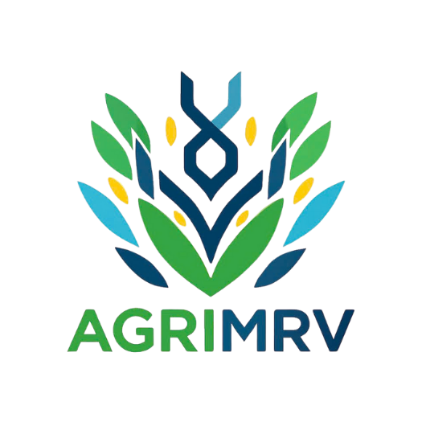

# AgriMRV | Scalable Blockchain-Powered MRV for Agroforestry & Rice-Based Carbon Projects – NABARD Hackathon 2025

<p>Project developed and maintained by Duy Tan University students (DTU_DZ), aimed at building a modern agricultural management platform with blockchain technology and AI for the NABARD Hackathon 2025 in India.</p>



<div>
  
  
  
  
  
  
</div>

# 🌱 AgriMRV | Scalable Blockchain-Powered MRV for Agroforestry & Rice-Based Carbon Projects

<div align="center">  
  <p align="center">
    
    
    
    
  </p>
  
  <br />
  
  <div align="center">
    <table>
    <tr>
      <td align="center" width="16.6%">
        
        <br/>
        <span style="font-size: 24px;">🐘</span>
      </td>
      <td align="center" width="16.6%">
        
        <br/>
        <span style="font-size: 24px;">🔺</span>
      </td>
      <td align="center" width="16.6%">
        
        <br/>
        <span style="font-size: 24px;">📱</span>
      </td>
      <td align="center" width="16.6%">
        
        <br/>
        <span style="font-size: 24px;">⛓️</span>
      </td>
      <td align="center" width="16.6%">
        
        <br/>
        <span style="font-size: 24px;">🧠</span>
      </td>
      <td align="center" width="16.6%">
        
        <br/>
        <span style="font-size: 24px;">🗄️</span>
      </td>
    </tr>
  </table>
  </div>
  
  <br />
  
  <div align="center">
    <kbd>
      <p align="center" style="padding: 10px; background-color: #f8f9fa; border-radius: 5px; width: 80%; margin: 0 auto;">
        <i>Modern multi-platform agricultural management platform with blockchain MRV system, 
        integrated AI analysis and smart recommendations for sustainable agriculture.</i>
      </p>
    </kbd>
  </div>
  
  <br />
  
  <div align="center">
    <a href="#-key-features">🚀 Key Features</a> •
    <a href="#-main-functions">🧩 Main Functions</a> •
    <a href="#-deployment">🚧 Deployment</a> •
    <a href="#-contributors">👨‍💻 Contributors</a>
  </div>
</div>


---

> **Revolutionizing Agriculture through Technology** - A comprehensive platform for agricultural management, verification, and financial inclusion.

## ✨ Introduction

**AgriMRV | Scalable Blockchain-Powered MRV for Agroforestry & Rice-Based Carbon Projects** is a comprehensive platform designed to modernize agricultural management and Monitoring, Reporting & Verification (MRV) through blockchain technology. This project combines cutting-edge technologies like AI, blockchain, and intuitive user interfaces to deliver personalized and intelligent agricultural management experience for the NABARD Hackathon 2025 in India.

<table>
  <tr>
    <td width="50%">
      <h3 align="center">🌟 Vision</h3>
      <p align="center">Personalize agricultural management through blockchain MRV technology and exceptional user experience</p>
    </td>
    <td width="50%">
      <h3 align="center">🎯 Mission</h3>
      <p align="center">Provide multi-platform agricultural management platform with blockchain MRV system and user-friendly interface</p>
    </td>
  </tr>
</table>

## ✨ Technology Stack

<div align="center">
  <table>
    <tr>
      <td align="center" width="16.6%">
        
        <br/>
        <span style="font-size: 24px;">🐘</span>
      </td>
      <td align="center" width="16.6%">
        
        <br/>
        <span style="font-size: 24px;">🔺</span>
      </td>
      <td align="center" width="16.6%">
        
        <br/>
        <span style="font-size: 24px;">📱</span>
      </td>
      <td align="center" width="16.6%">
        
        <br/>
        <span style="font-size: 24px;">⛓️</span>
      </td>
      <td align="center" width="16.6%">
        
        <br/>
        <span style="font-size: 24px;">🧠</span>
      </td>
      <td align="center" width="16.6%">
        
        <br/>
        <span style="font-size: 24px;">🗄️</span>
      </td>
    </tr>
  </table>
</div>

## 🚀 Key Features

<table>
  <tr>
    <td width="50%" valign="top">
      <h3>🔹 Multi-Platform</h3>
      <p>System designed to operate across multiple platforms, including web and mobile devices.</p>
    </td>
    <td width="50%" valign="top">
      <h3>🔺 Laravel Backend</h3>
      <p>Backend API built with Laravel, providing secure and efficient RESTful endpoints.</p>
    </td>
  </tr>
  <tr>
    <td width="50%" valign="top">
      <h3>📱 Mobile Application</h3>
      <p>Mobile app developed with React Native, enabling agricultural management across multiple devices.</p>
    </td>
    <td width="50%" valign="top">
      <h3>⛓️ Blockchain MRV</h3>
      <p>System uses blockchain to verify and report agricultural data transparently and immutably.</p>
    </td>
  </tr>
  <tr>
    <td width="50%" valign="top">
      <h3>🧠 AI Analysis</h3>
      <p>System uses AI to analyze agricultural data and suggest optimal solutions.</p>
    </td>
    <td width="50%" valign="top">
      <h3>🌱 Sustainable Agriculture</h3>
      <p>Focus on sustainable agriculture with carbon footprint tracking and efficient resource management.</p>
    </td>
  </tr>
</table>

## 📁 Project Structure

```
AgriMRV/
├── Agri_Mobile/          # React Native Mobile Application
├── Agri_Be/             # Laravel Backend API
├── README.md            # This file
├── CHANGELOG.md         # Version history
├── CONTRIBUTING.md      # Contribution guidelines
├── CODE_OF_CONDUCT.md   # Code of conduct
└── LICENSE              # MIT License
```

### 🌟 Key Features

#### Mobile App (Agri_Mobile)
- **📱 Cross-Platform**: Native iOS and Android applications
- **🤖 AI-Powered Analytics**: Smart crop analysis and recommendations
- **⛓️ Blockchain Integration**: Immutable record keeping and verification
- **💳 Financial Inclusion**: Credit scoring and loan management
- **📊 Real-time Monitoring**: Live farm data tracking and alerts
- **🔍 QR Code Verification**: Product traceability and authenticity
- **🌍 Sustainability Focus**: Carbon footprint tracking and reporting

#### Backend API (Agri_Be)
- **🔧 RESTful API**: Complete API for all mobile app features
- **🔐 Authentication**: Secure user authentication with Laravel Sanctum
- **💾 Database Management**: MySQL database with comprehensive data models
- **📁 File Management**: Secure file upload and storage system
- **🤖 AI Integration**: Backend AI analysis services
- **⛓️ Blockchain Services**: Blockchain integration for carbon credits
- **📊 Analytics**: Data analytics and reporting capabilities

## 🚀 Quick Start

### Prerequisites

- Node.js >= 18
- React Native CLI
- PHP >= 8.1
- Composer
- MySQL
- Xcode (for iOS development)
- Android Studio (for Android development)
- CocoaPods (for iOS dependencies)

### Installation

1. **Clone the repository**
   ```bash
   git clone https://github.com/vietvo371/AgriMRV.git
   cd AgriMRV
   ```

2. **Setup Backend (Agri_Be)**
   ```bash
   cd Agri_Be
   composer install
   cp .env.example .env
   php artisan key:generate
   php artisan migrate
   php artisan serve
   ```

3. **Setup Mobile App (Agri_Mobile)**
   ```bash
   cd Agri_Mobile
   npm install
   # or
   yarn install
   ```

4. **iOS Setup**
   ```bash
   cd ios
   pod install
   cd ..
   ```

5. **Run the application**
   ```bash
   # iOS
   npx react-native run-ios
   
   # Android
   npx react-native run-android
   ```

## 🖼️ Demo Screenshots

<div align="center">
  <table>
    <tr>
      <td align="center"><strong>Agricultural Dashboard</strong></td>
      <td align="center"><strong>Plot Management</strong></td>
    </tr>
    <tr>
      <td></td>
      <td></td>
    </tr>
    <tr>
      <td align="center"><strong>AI Analysis</strong></td>
      <td align="center"><strong>Blockchain MRV</strong></td>
    </tr>
    <tr>
      <td></td>
      <td></td>
    </tr>
  </table>
</div>

## 🛠️ Improvements & Bug Fixes

<div align="center">
  <table>
    <tr>
      <td align="center" width="25%">
        <div style="font-size: 36px;">🔄</div>
        <h3>Blockchain Optimization</h3>
        <p>Improve performance and security of blockchain MRV system</p>
      </td>
      <td align="center" width="25%">
        <div style="font-size: 36px;">🚀</div>
        <h3>Enhanced AI Analysis</h3>
        <p>Improve accuracy of agricultural analysis algorithms</p>
      </td>
      <td align="center" width="25%">
        <div style="font-size: 36px;">🐛</div>
        <h3>Data Sync Fixes</h3>
        <p>Resolve issues in data synchronization processes</p>
      </td>
      <td align="center" width="25%">
        <div style="font-size: 36px;">📦</div>
        <h3>UX/UI Improvements</h3>
        <p>Enhance user experience across all platforms</p>
      </td>
    </tr>
  </table>
</div>

## 🏗️ Architecture

### Technology Stack

#### Frontend (Agri_Mobile)
- **Framework**: React Native 0.81.0
- **Language**: TypeScript
- **State Management**: React Context API
- **Navigation**: React Navigation 7.x
- **UI Components**: React Native Paper
- **Charts**: React Native Chart Kit
- **Maps**: React Native Maps
- **Camera**: React Native Vision Camera
- **Storage**: AsyncStorage
- **HTTP Client**: Axios
- **Cryptography**: Crypto-JS

#### Backend (Agri_Be)
- **Framework**: Laravel 10.x
- **Language**: PHP 8.1+
- **Database**: MySQL
- **Authentication**: Laravel Sanctum
- **API**: RESTful API
- **File Storage**: Laravel Storage
- **Queue**: Laravel Queue
- **Testing**: PHPUnit

### Project Structure

#### Mobile App (Agri_Mobile)
```
Agri_Mobile/src/
├── components/          # Reusable UI components
├── screens/            # Application screens
├── navigation/         # Navigation configuration
├── contexts/           # React contexts
├── hooks/              # Custom React hooks
├── utils/              # Utility functions
├── theme/              # Theme configuration
└── assets/             # Images and static assets
```

#### Backend API (Agri_Be)
```
Agri_Be/
├── app/
│   ├── Http/Controllers/  # API Controllers
│   ├── Models/           # Eloquent Models
│   ├── Services/         # Business Logic
│   └── Traits/           # Reusable Traits
├── database/
│   ├── migrations/       # Database migrations
│   └── seeders/         # Database seeders
├── routes/
│   └── api.php          # API routes
└── config/              # Configuration files
```

## 🧩 Main Functions

<table>
  <tr>
    <td width="50%" valign="top">
      <ul>
        <li>✅ <b>Farm Profile Management</b> - Create and manage detailed farm information</li>
        <li>✅ <b>Plot Management</b> - Track and manage cultivation plots</li>
        <li>✅ <b>MRV Reporting</b> - Report and verify agricultural activities</li>
        <li>✅ <b>AI Analysis</b> - Smart analysis and optimization recommendations</li>
        <li>✅ <b>Blockchain Verification</b> - Verify data through blockchain</li>
        <li>✅ <b>Carbon Credits Management</b> - Track and trade carbon credits</li>
        <li>✅ <b>QR Code System</b> - QR code system for traceability</li>
        <li>✅ <b>Cooperative Management</b> - Manage cooperative members</li>
      </ul>
    </td>
    <td width="50%" valign="top">
      <ul>
        <li>✅ <b>User Management</b> - Add, edit, delete user information</li>
        <li>✅ <b>Agricultural Data Management</b> - Add, edit, delete agricultural data</li>
        <li>✅ <b>Report Management</b> - Add, edit, delete MRV reports</li>
        <li>✅ <b>Blockchain Management</b> - Manage blockchain transactions</li>
        <li>✅ <b>AI Analysis Management</b> - Manage AI analysis results</li>
        <li>✅ <b>Financial Management</b> - Track and manage financial transactions</li>
        <li>✅ <b>Carbon Credits Management</b> - Process carbon credit transactions</li>
        <li>✅ <b>Statistics & Reports</b> - Analyze data and generate reports</li>
      </ul>
    </td>
  </tr>
</table>

## 🎯 NABARD Hackathon Innovation

### 🌟 Unique Value Propositions

1. **AI-Driven Insights**: Machine learning algorithms provide personalized recommendations for crop optimization
2. **Blockchain Verification**: Immutable record keeping ensures data integrity and builds trust
3. **Financial Inclusion**: Credit scoring system enables access to financial services for underserved farmers
4. **Real-time Monitoring**: Live data tracking with instant alerts and notifications
5. **Sustainability Metrics**: Carbon footprint tracking promotes environmentally conscious farming

### 🏆 Competitive Advantages

- **Comprehensive Solution**: End-to-end agricultural management platform
- **Scalable Architecture**: Designed to handle thousands of concurrent users
- **Offline Capability**: Works without internet connection
- **Multi-language Support**: Vietnamese and English localization
- **Cross-platform**: Single codebase for iOS and Android

## 📊 Impact & Metrics

### Target Impact

- **👥 Users**: 10,000+ farmers in first year
- **🌾 Farms**: 5,000+ farms managed
- **💰 Financial Impact**: $1M+ in facilitated loans
- **🌍 Environmental**: 20% reduction in carbon footprint
- **📈 Efficiency**: 30% improvement in farm productivity

### Key Performance Indicators

- User engagement rate: 85%
- Data accuracy: 99.9%
- App performance: <2s load time
- Crash rate: <0.1%
- User satisfaction: 4.8/5.0

## 🔧 Development

### Available Scripts

#### Mobile App (Agri_Mobile)
```bash
cd Agri_Mobile

# Start Metro bundler
npm start

# Run on iOS
npm run ios

# Run on Android
npm run android

# Run tests
npm test

# Lint code
npm run lint

# Build for production
npm run build
```

#### Backend API (Agri_Be)
```bash
cd Agri_Be

# Install dependencies
composer install

# Run migrations
php artisan migrate

# Start development server
php artisan serve

# Run tests
php artisan test

# Clear cache
php artisan cache:clear
```

### Code Quality

#### Mobile App (Agri_Mobile)
- **TypeScript**: Full type safety
- **ESLint**: Code quality enforcement
- **Prettier**: Code formatting
- **Jest**: Unit testing
- **Husky**: Git hooks for quality gates

#### Backend API (Agri_Be)
- **PHP CS Fixer**: Code formatting
- **PHPUnit**: Unit testing
- **Laravel Pint**: Code style enforcement
- **PHPStan**: Static analysis

## 🤝 Contributing

We welcome contributions! Please see our [Contributing Guidelines](CONTRIBUTING.md) and [Code of Conduct](CODE_OF_CONDUCT.md) for details.

1. Fork the repository
2. Create your feature branch (`git checkout -b feature/AmazingFeature`)
3. Commit your changes (`git commit -m 'Add some AmazingFeature'`)
4. Push to the branch (`git push origin feature/AmazingFeature`)
5. Open a Pull Request

## 📄 License

This project is licensed under the MIT License - see the [LICENSE](LICENSE) file for details.

## 👨‍💻 Contributors

<div align="center">
  <table>
    <tr>
      <td align="center" width="20%">
        <a href="mailto:thanhtruong23111999@gmail.com">
          
          <br />
          <b>Le Thanh Truong</b>
        </a>
        <br />
        <sub>thanhtruong23111999@gmail.com</sub>
        <br />
        <a href="https://github.com/vietvo371/AgriMRV/commits?author=thanhtruong">
          
        </a>
        <br />
        <small>Team Leader</small>
      </td>
      <td align="center" width="20%">
        <a href="mailto:vietvo371@gmail.com">
          
          <br />
          <b>Vo Van Viet</b>
        </a>
        <br />
        <sub>vietvo371@gmail.com</sub>
        <br />
        <a href="https://github.com/vietvo371/AgriMRV/commits?author=vietvo371">
          
        </a>
        <br />
        <small>Lead Developer</small>
      </td>
      <td align="center" width="20%">
        <a href="mailto:vannhan130504@gmail.com">
          
          <br />
          <b>Nguyen Van Nhan</b>
        </a>
        <br />
        <sub>vannhan130504@gmail.com</sub>
        <br />
        <a href="https://github.com/vietvo371/AgriMRV/commits?author=vannhan">
          
        </a>
        <br />
        <small>Backend Developer</small>
      </td>
      <td align="center" width="20%">
        <a href="mailto:kkdn011@gmail.com">
          
          <br />
          <b>Nguyen Ngoc Duy Thai</b>
        </a>
        <br />
        <sub>kkdn011@gmail.com</sub>
        <br />
        <a href="https://github.com/vietvo371/AgriMRV/commits?author=duythai">
          
        </a>
        <br />
        <small>Mobile Developer</small>
      </td>
      <td align="center" width="20%">
        <a href="mailto:Tructran172003@gmail.com">
          
          <br />
          <b>Tran Trung Truc</b>
        </a>
        <br />
        <sub>Tructran172003@gmail.com</sub>
        <br />
        <a href="https://github.com/vietvo371/AgriMRV/commits?author=trungtruc">
          
        </a>
        <br />
        <small>UI/UX Designer</small>
      </td>
    </tr>
  </table>
</div>

## 📞 Contact

- **Team**: DTU_DZ - Đại học Duy Tân
- **Hackathon**: NABARD Hackathon - India
- **Email**: vietvo371@gmail.com
- **GitHub**: [@vietvo371](https://github.com/vietvo371)
- **Project Link**: [https://github.com/vietvo371/AgriMRV](https://github.com/vietvo371/AgriMRV)

## 🙏 Acknowledgments

- NABARD Hackathon organizers for the opportunity
- React Native community for the amazing framework
- Laravel community for the robust backend framework
- Blockchain community for innovative solutions
- Agricultural experts who provided domain knowledge

---

<div align="center">
  <strong>Built with ❤️ for sustainable agriculture and NABARD Hackathon</strong>
</div>
